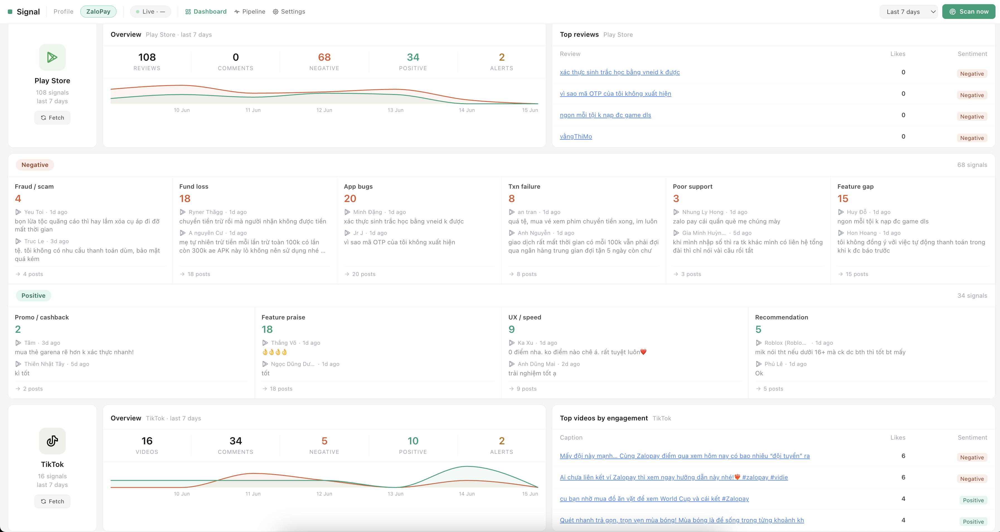

# Signal



Social media listening dashboard for everyone. Collects posts from TikTok, Threads, Facebook, App Store, and Google Play, then uses an LLM to classify sentiment and surface alerts when issue categories spike.

## What it does

- **Collects** posts and reviews on a cron schedule (08:00 and 20:00 daily) for each configured profile
- **Classifies** each post using an OpenAI-compatible LLM into sentiment categories (fraud/scam, app bugs, transaction failure, feature praise, etc.)
- **Alerts** when a subcategory crosses a count threshold within a time window
- **Streams** classification results to the dashboard in real time via SSE

## Data sources

| Source | How |
|---|---|
| TikTok | SocialFetch API — keyword and hashtag search |
| Threads | SocialFetch API — keyword search |
| Facebook | SocialFetch API — page URL scrape |
| App Store | iTunes RSS feed (public, no auth) |
| Google Play | `google-play-scraper` npm package |

## Stack

- **Next.js 14** (App Router, standalone output)
- **SQLite** via `better-sqlite3` + Drizzle ORM
- **LLM classification** — any OpenAI-compatible endpoint
- **node-cron** — in-process scheduler

## Environment variables

| Variable | Description |
|---|---|
| `OPENAI_API_KEY` | LLM API key |
| `OPENAI_BASE_URL` | OpenAI-compatible base URL |
| `LLM_MODEL` | Model name (default: `gpt-4o-mini`) |
| `SOCIAL_FETCH_API_KEY` | [SocialFetch](https://socialfetch.dev) API key |
| `DATABASE_URL` | SQLite path (default: `file:/data/claw.db`) |

## Local development

```bash
npm install

# Apply migrations
npm run db:migrate

# (Optional) seed sample data
npm run seed

npm run dev
```

Open [http://localhost:3000](http://localhost:3000).

## Database migrations

```bash
# Generate a new migration after editing db/schema.ts
npm run db:generate

# Apply pending migrations
npm run db:migrate
```

## Deployment (VNGCloud AgentBase)

`deploy.sh` handles everything: backs up the live database, builds the Next.js app, builds and pushes a Docker image to the VNGCloud Container Registry, then creates or updates the AgentBase runtime.

```bash
# Deploy with live database carried forward
bash deploy.sh

# Deploy with a fresh empty database
bash deploy.sh --fresh
```

The Docker image uses a two-stage build. The database is stored on a `/data` volume so it persists across redeployments. The entrypoint seeds `/data/claw.db` from `seed.db` on first boot if no database exists yet.

## Profiles

Monitoring is configured through **profiles** (Settings page or `profiles` table). Each profile specifies:

- TikTok keywords and hashtags
- Threads keywords
- Facebook page URLs
- App Store app ID + country
- Google Play package ID

The pipeline runs for every active profile on each scheduled tick.
